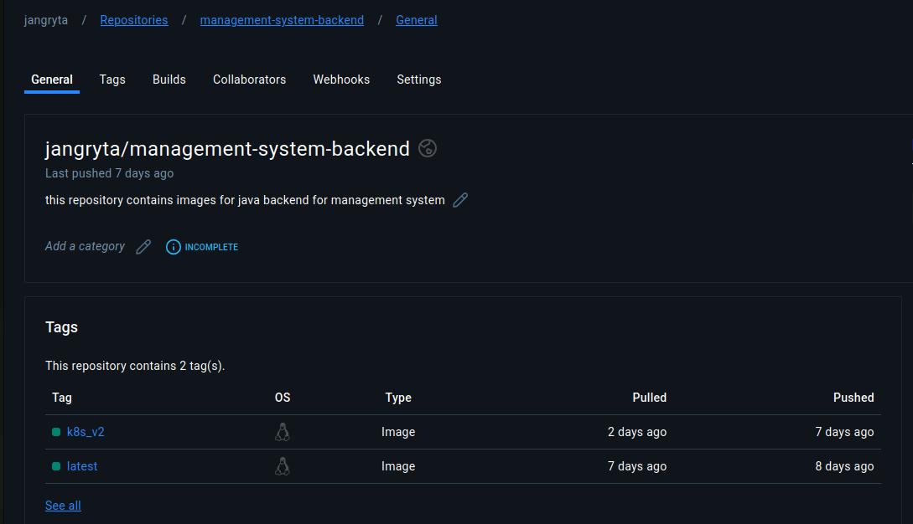
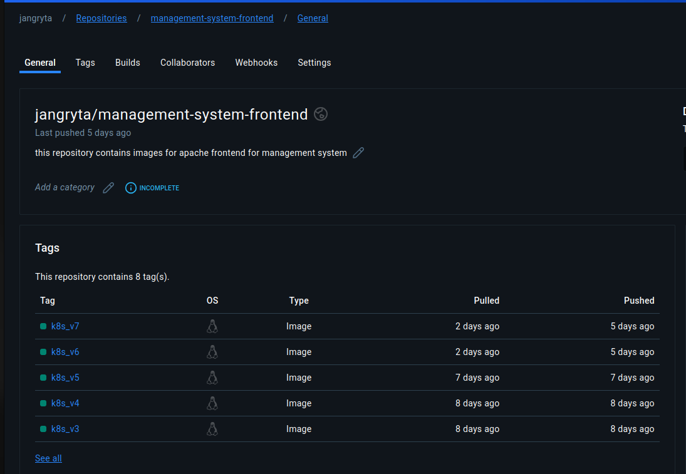
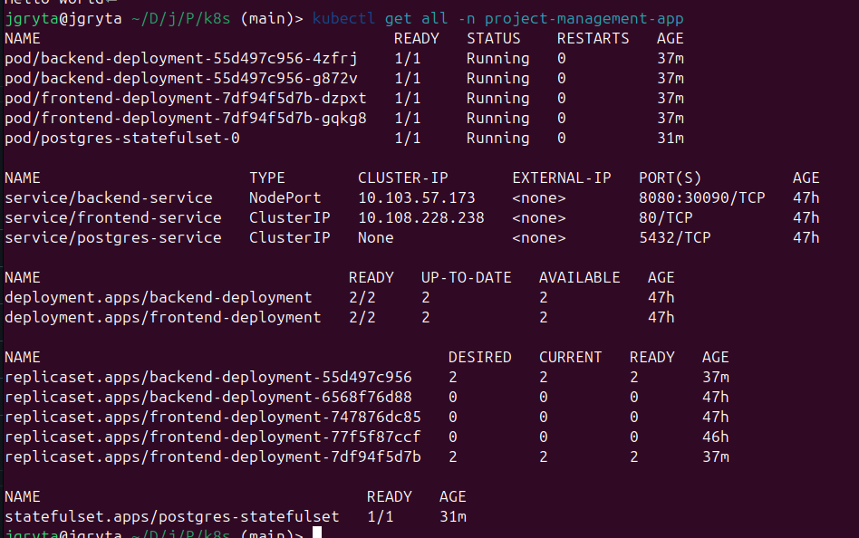
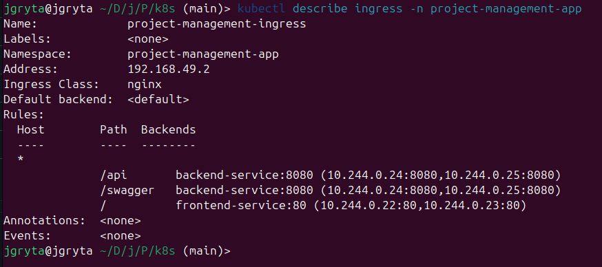
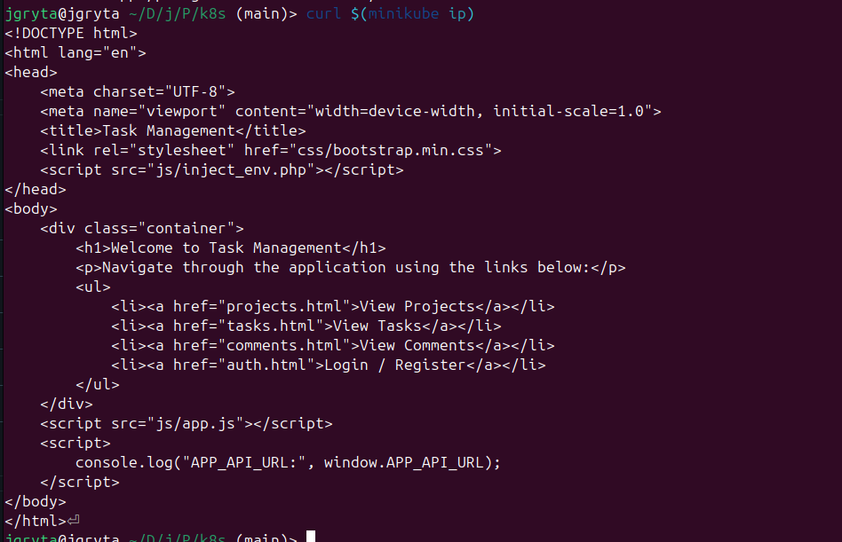
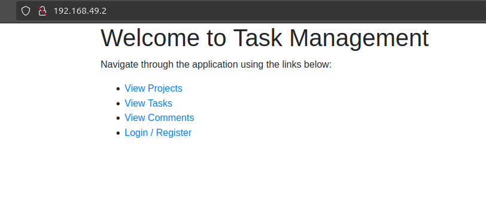
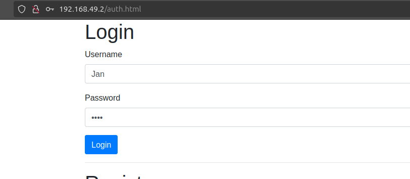
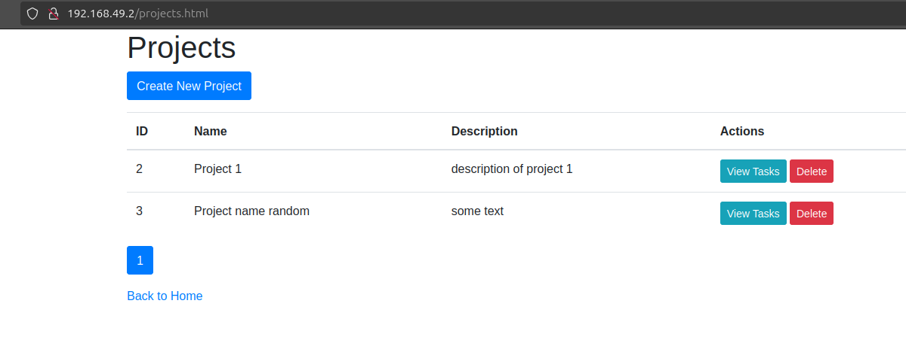
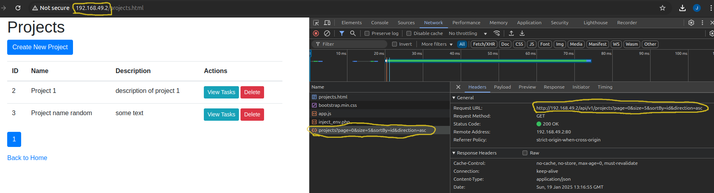

# Full-Stack Deployment in Kubernetes

This project demonstrates the deployment of a LAMP stack-like architecture in Kubernetes using Minikube. The stack includes a Java backend and an Apache-based frontend with a static page, along with a MySQL database for persistence. The deployment utilizes Kubernetes manifests to define resources, configurations, and access methods.

## 1. Project Overview

### Stack Type
- **Frontend**: Apache with a static pages
- **Backend**: Java application
- **Database**: Postgres

### Assumptions
1. All Docker images are hosted in a private Docker repository.
2. Access to the frontend and backend services is achieved using `curl $(minikube ip)` or with the browser due to issues with `minikube tunnel`.
3. The backend API is available at `/api/v1`.
4. Kubernetes manifests include configurations for Namespaces, Deployments, Services, ConfigMaps, Secrets, StatefulSets, and Ingress resources.

### Image repositories

*Backend image*


*Frontend image*


### Kubernetes Resources
The following Kubernetes manifests are used:
- **Namespace**: `pma_namespace.yaml`
- **ConfigMap**: `pma_env_cm.yaml`
- **Secrets**: `pma_secret_sc.yaml`
- **StatefulSet for Postgres**: `pma_db_ss.yaml`
- **Deployment for Java Backend**: `pma_backend_dep.yaml`
- **Deployment for Frontend**: `pma_frontend_dep.yaml`
- **Service for Database**: `pma_db_sv.yaml`
- **Service for Backend**: `pma_backend_sv.yaml`
- **Service for Frontend**: `pma_frontend_sv.yaml`
- **Ingress Resource**: `pma_ingress.yaml`

## 2. Deployment

### Instructions
To deploy the stack, use the following steps:

1. **Start Minikube**:
   ```bash
   minikube start
   ```

2. **Apply Kubernetes manifests**:
   Navigate to the directory containing the YAML files and run:
   ```bash
   kubectl apply -f .
   ```

3. **Verify Resources**:
   Confirm that all resources are running:
   ```bash
   kubectl get all -n project-management-app
   ```
   

4.  **Check ingress**:
   ```bash
	kubectl describe ingress -n project-management-app
   ```
   


5. **Access Services**:
   - **Frontend**: Access the static page via:
     ```bash
     curl $(minikube ip)
     ```
     
   - **Backend API**: Access the backend service via:
     ```bash
     curl $(minikube ip)/api/v1
     ```
     

## 3. Results

### Results in the browser






## 4. YAML File Descriptions

### `pma_namespace.yaml`
Defines a custom namespace (`project-management-app`) for isolating all stack resources.

### `pma_env_cm.yaml`
Configures environment variables for the stack, including database connection details and backend access route.

### `pma_secret_sc.yaml`
Stores sensitive data like database credentials securely.

### `pma_db_ss.yaml`
Defines a PostgreSQL StatefulSet for database persistence.

### `pma_backend_dep.yaml`
Deploys the Java backend application as a Deployment resource.

### `pma_frontend_dep.yaml`
Deploys the Apache-based frontend as a Deployment resource.

### `pma_db_sv.yaml`
Creates a headless ClusterIP Service for the PostgreSQL database.

### `pma_backend_sv.yaml`
Creates a ClusterIP Service for the backend application.

### `pma_frontend_sv.yaml`
Creates a ClusterIP Service for the frontend application.

### `pma_ingress.yaml`
Defines an Ingress resource to route external traffic to the backend and frontend services (currently not utilized due to `minikube tunnel` issues).

